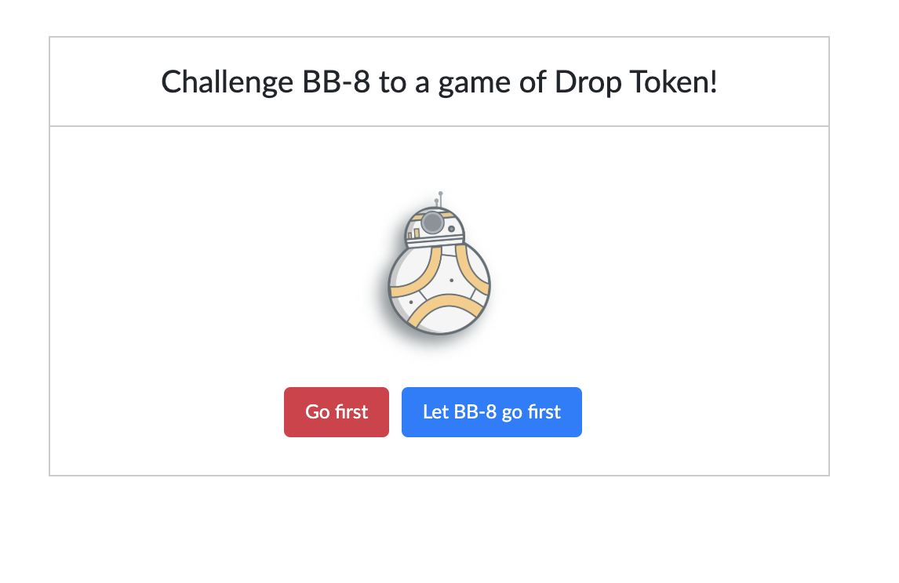
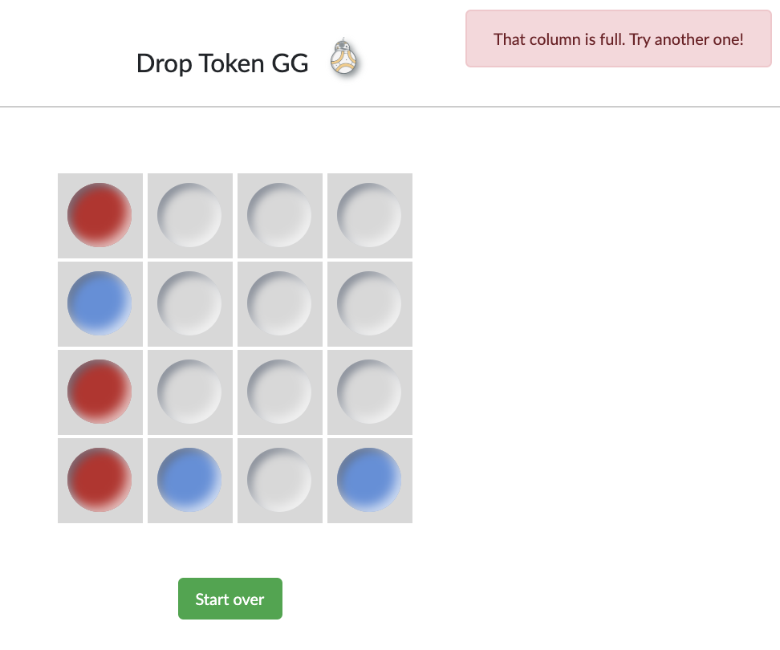

# Drop Token GG

## Overview

Drop Token takes place on a 4x4 grid. A token is dropped along a column (labeled 0‐3) and said token goes to the 
lowest unoccupied row of the board. 

A player wins when they have 4 tokens next to each other either along a row, in a column, or on a
diagonal. 

If the board is filled, and nobody has won then the game is a draw. 

Each player takes a turn, starting with player 1, until the game reaches either win or draw. 

If a player tries to put a token in a column that is already full, that results in an error state, and the player must play again until they play a valid move.

## Game mechanics

The player is going up against none other than BB-8 and has the option to go first or let BB-8 make the first move:

Once this choice has been made, the game is on! The player and BB-8 drop tokens until one of them wins or there is a draw.

If a player tries to put a token in a column that is already full, the player is notified that they need to play again.

## Algorithm

1. We will initialize an N x N board with zero values. In this case N = 4.
   
2. When player1 makes a move we will populate the corresponding [row,cell] with the value 1.
   When player 2 makes a move we will use the board size + 1 (in this case 4+1 = 5).
   
   Every time a player makes a move, the corresponding row, column sum arrays and diagonal sums will be adjusted accordingly, by adding 1 if player1 moved or 5 if player2 moved.
   We want to keep these numbers far apart from each other to make it easier to determine a win without having to iterate through the board matrix every time, thus reducing our time complexity from O(N^2) to O(N).
   
   Player 1 wins if the sum of any column, row or diagonal reaches N (4 in our case).
   
   Player 2 wins if the sum of any column, row or diagonal reaches N * (N + 1) (20 in our case).
   
3. Since we have an NxN board, the maximum number of moves we can have in a game is N^2 (for a 4x4 board it would be 16).  
   A draw is reached when the moves array length is equal to N^2.

## How to run

In the project directory, you can run:

### `yarn start` or `npm start`

Runs the app in the development mode. 
Open [http://localhost:3000](http://localhost:3000) to view it in the browser.

The page will reload if you make edits. 
You will also see any lint errors in the console.

### `yarn test` or `npm test`

Launches the test runner in the interactive watch mode. 
See the section about [running tests](https://facebook.github.io/create-react-app/docs/running-tests) for more information.

### `yarn build`

Builds the app for production to the `build` folder. 
It correctly bundles React in production mode and optimizes the build for the best performance.

The build is minified and the filenames include the hashes. 
Your app is ready to be deployed!

See the section about [deployment](https://facebook.github.io/create-react-app/docs/deployment) for more information.
